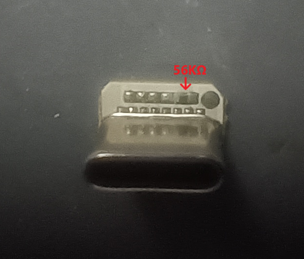
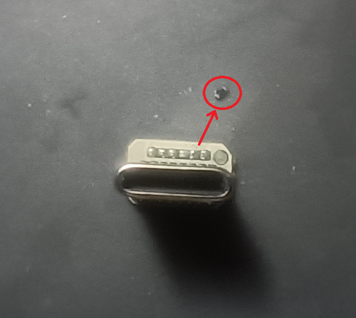
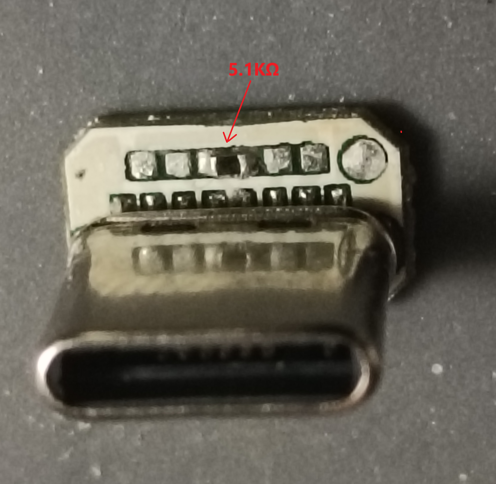
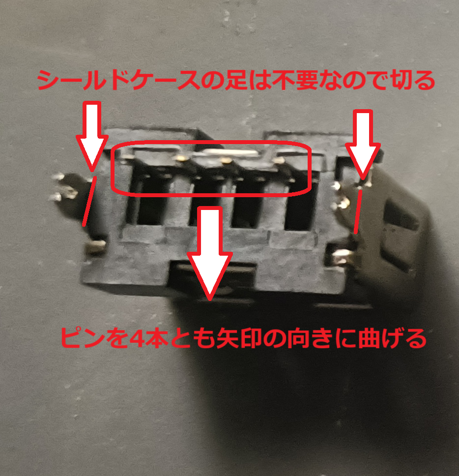
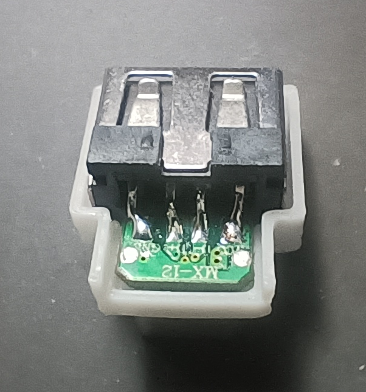

# USB Type-C 変換アダプタ

* USB Type-C に USB A の機器を接続するためのOTG仕様、L型の小型変換アダプタです
* USB2.0のみ対応(USB3.0の機器を接続した場合はUSB2.0での動作となります)
* L字型変換アダプタとしてはおそらく市販のものより小型です
* ケースは3Dプリンタで作成しデータも公開していますのでカスタマイズしてオリジナルのケースを作ることもできます

 [ｽﾀｯｸﾁｬﾝ](https://protopedia.net/prototype/2345)にM5Stackの[Module LLM](https://docs.m5stack.com/ja/module/Module-LLM)を取り付けてWi-Fiアダプタを付けた例・・・  
 というかこれのために作りましたw  

  
  横に飛び出すのを最小限で付けることができます

  ## 使用部品について
  ### BOM(部品リスト) 　1つに付き各1個必要
|名称|仕様等|イメージ|購入先等(備考)|  
|:--|:--|:--:|:--|  
|USB Type-C プラグ|基板にMX-12と書いてある物||JQDXD Store （AliExpless） https://ja.aliexpress.com/item/1005005457314834.html|  
|USB A ソケット|基板用縦型長さ10mm||GGEERPOELE Store (AliExpress)　　https://ja.aliexpress.com/item/32808945847.html|
 チップ抵抗|5.1KΩ サイズ:0402(inch)/1005(mm) 誤差:1%||DSSRQI Official Store (AliExptress)  https://ja.aliexpress.com/item/1005001793275257.html|
 |ケース|[case](./case)にあるデータを3Dプリンタで作成|| 
* USB コネクタ(Type-Cプラグ/Aソケット) についてはこの物に合わせてケースの3Dデータが作られているのでこれ以外のものを利用する場合は物に合わせたデータの編集等が必要となります
* USB Type-C プラグはOTG仕様のものではないため改造(チップ抵抗交換)をして利用します
* ケースについては3Dデータ(STLおよびSTEP)のみの配布となりますので各自3Dプリンタで出力や3Dプリントサービスにより入手願います
## 制作について
### 制作に必要なもの
* はんだごて、はんだ 等   
小さいチップ抵抗を扱うのでこて先の細いもの
* ニッパー  
  USB Aコネクタの不要な足の切断に使います
* ピンセット  
  チップ抵抗を扱う際にあると便利？  
* ケースの作成を自分で行う場合はプリンタが必要  
  (3Dプリントサービスへ依頼して入手する場合は不要)  
など  

### USB Type-C コネクタのチップ抵抗交換
* 利用する USB Type-C コネクタは購入時は CCピン が 56KΩの抵抗でプルアップされておりOTG仕様にするためには5.1KΩの抵抗でプルダウンに変更する必要があります（制作でここが一番難易度が高いと思います）
* そのためまず元々付いている56KΩのチップ抵抗を取り外します  
 
 
* その後中央の位置に5.1KΩのチップ抵抗を取り付けます
 

### USB A コネクタ の加工
* USB A コネクタのシールドケースの足は不要なので切ります
* 4本のピンを写真の向きに折り曲げます
 

## USB Type-C コネクタ と USB A コネクタの接続
* USB Type-C コネクタ と USB A コネクタ を下側のケース(USB Type-C用の穴が開いている方)にはめ込んで位置を合わせます、そしてそのままはんだ付けします  
Type-Cコネクタ基板のランドとUSB Aコネクタの足は接触していないのではんだを盛って空中でブリッジさせてください 
 

## 上側ケースのはめ込み 完成
* 後は上側のケースをはめ込んで完成です
 
  
